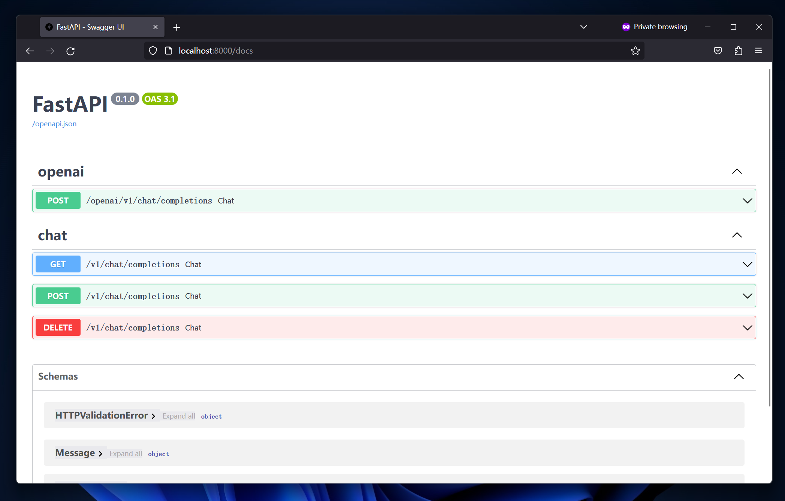

# Hi, welcome to chatglm-fastapi

see [config.ipynb](./config.ipynb)



## 食用方法

**注意：** 以下步骤仅针对docker版本大于21.0.1适用

1. 下载源码

```shell
git clone https://github.com/UNICKCHENG/chatglm-fastapi.git
cd chatglm-fastapi
```

2. 修改配置文件

```shell
mv .env.example .env
vim .env
```

3. 启动

```shell
docker-compose build && docker-compose up -d
```

4. 设置用户key

```shell
# 进入容器
docker exec -it chatglm-api bash
python3
```

```python
# 添加用户key

# user_id 尽量使用 数字、字母、下划线 的组合
user_id = 'your_user_id'
user_passwd = 'your-private-password'

from scripts.user import client as redis
redis.add_user(user_id, user_passwd)
```